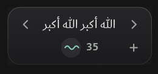

<div align="center">

# ذكر · Dhikr

Widget صغير جدًا بتصميم Dark Glass يعيش على حافة شاشة Windows،
يذكّرك بذكر مختلف كل ساعة، مع عداد تسبيح بسيط.

<br>

<a href="https://github.com/abdalla7ramadan57-a11y/dhikr/releases/latest/download/DhikrSetup.exe">
  
</a>

**Windows 10 / 11 · 100 KB · بدون إنترنت أو حساب**

<br>



</div>

## التثبيت
1. اضغط زر **Install** بالأعلى، فيتم تنزيل `DhikrSetup.exe`.
2. افتح الملف واضغط **تثبيت**.
3. خلاص: البرنامج يعمل على حافة الشاشة، ويبدأ تلقائيًا مع Windows، وتجد اختصاره على سطح المكتب.

> لو ظهرت رسالة **Windows protected your PC**: اضغط **More info** ثم **Run anyway** (البرنامج غير موقّع رقميًا).

للإزالة: Settings ← Apps ← Installed apps ← **Dhikr - ذكر** ← Uninstall. أذكارك وعداداتك تبقى محفوظة.

## الاستخدام
- **ضغطة على المقبض**: يتمدد ويعرض `‹ الذكر ›` والعداد.
- **〰** أو الضغط على الذكر: العداد +1. لكل ذكر عداده الخاص.
- **‹ ›**: الذكر السابق / التالي.
- **+**: إضافة ذكر جديد.
- **−**: حذف ذكر أضفته: اختره بالأسهم ‹ › ثم **✓** للحذف أو **✕** للإلغاء.
- **السحب**: انقله لأي حافة (يمين/يسار) ويلتصق بها.
- **ضغطة يمين**: القائمة (إضافة ذكر، مدة التذكير، التشغيل مع Windows، الإعدادات، خروج).
- **الإعدادات**: قائمة الأذكار (اختيار / حذف ما أضفته)، مدة التذكير (30 دقيقة / ساعة / ساعتين)، التشغيل مع Windows، جهة الشاشة.

البيانات محفوظة محليًا فقط في `%AppData%\Dhikr\data.json`.

## البناء من المصدر
```powershell
powershell -ExecutionPolicy Bypass -File build.ps1
```
يحتاج Visual Studio Build Tools 2019+ (مترجم Roslyn). الناتج في `release\`: `Dhikr.exe` و `DhikrSetup.exe`.

- الأذكار الافتراضية ومدد التذكير: [`src/Defaults.cs`](src/Defaults.cs)
- اختبار التذكير بسرعة: `Dhikr.exe --reminder-seconds 30`

C# · WPF · .NET Framework 4.8 (موجود مسبقًا في Windows 10/11)
